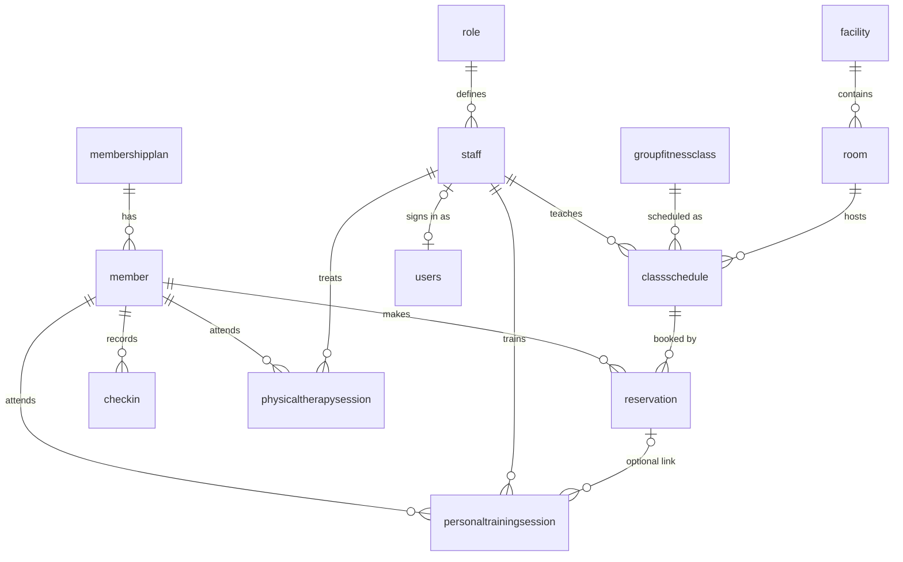

# Peak Performance — gym management system

A full-stack app for running a fitness center: members, staff, class scheduling and booking,
personal training, physical therapy, check-ins and a KPI dashboard. The MySQL schema enforces the
gym's business rules, and the React + Express app is built on top of it.

**Stack:** React 19 + TypeScript + Vite · TanStack Query · Recharts · Node/Express 5 · MySQL 8 · Zod ·
JWT (httpOnly cookie) + bcrypt · Vitest + Supertest · ESLint + Prettier · GitHub Actions · Docker Compose

## Features

- **Sign-in and role-based access** for four roles (see [Roles](#roles)). Permissions are defined once on the
  server; the UI hides what a role can't do, and the API enforces it regardless.
- **Full CRUD** for members, staff, classes, class schedules, training sessions, therapy appointments and logins.
- **Double-booking prevention:** an instructor/trainer/therapist can't be booked twice across classes, training
  and therapy; a room can't host two classes at once; a member can't have two personal sessions at once.
  Checks run inside a transaction with row locks, so two simultaneous requests can't both win.
- **Class booking** with capacity enforced atomically (the lower of the class limit and room capacity).
- **Therapy notes are restricted** to managers and the treating therapist, and never searchable by others.
- **Search, sort, filter and pagination** on every list (state kept in the URL, so views are shareable).
- **Dashboard** with KPIs (members, recurring revenue for managers, check-in trend) and charts
  (check-ins per day, busiest hours, plan mix, class fill rate).
- **Accessible, responsive UI:** native `<dialog>` modals (focus trap, Escape), labelled inputs with
  field-level errors, keyboard-sortable tables, visible focus, skip link, live-region toasts, collapsible
  sidebar on phones, tables that scroll instead of clipping.

## Quick start (Docker)

```bash
cp .env.example .env        # fill in the four values
docker compose up --build   # then open http://localhost:8080
```

Sign in as `manager@demo.test`, `frontdesk@demo.test`, `trainer@demo.test` or `therapist@demo.test`
with the `DEMO_PASSWORD` you chose. The database starts with sample data and a month of demo activity.

## Local development

**You need:** [Node.js](https://nodejs.org) 20+, MySQL 8.0.16+ and MySQL Workbench.

### 1. Get the code

```bash
git clone https://github.com/<your-username>/peak-performance.git
cd peak-performance
npm install
```

### 2. Set up the database (MySQL Workbench, signed in as root)

Open each file with **File → Open SQL Script…** and run the whole file with **Ctrl+Shift+Enter**.

- **New database:** `server/sql/schema.sql` → `002_auth_and_scheduling.sql` → `seed.sql`
  (optional: `seed-demo-activity.sql` adds recent activity so the dashboard has data)

Then create the database user the app connects as. Pick your own password, and run **both lines together**
(select both, then Ctrl+Shift+Enter):

```sql
CREATE USER 'peak_app'@'localhost' IDENTIFIED BY 'your-password';
GRANT SELECT, INSERT, UPDATE, DELETE ON peakperformance.* TO 'peak_app'@'localhost';
```

### 3. Configure the API

Copy the example settings file:

```bash
cp server/.env.example server/.env        # Windows Command Prompt: copy server\.env.example server\.env
```

Open `server/.env` and fill in two values:

- `DB_PASSWORD=` the **same** password you used in `CREATE USER` above
- `JWT_SECRET=` a random string of at least 32 characters. Generate one with:
  ```bash
  node -e "console.log(require('crypto').randomBytes(48).toString('base64url'))"
  ```

Check the connection:

```bash
npm run db:check -w server
```

You should see `Connected to 'peakperformance'`. A note that there's no manager login yet is expected.

### 4. Create your first login

```bash
npm run user:create -w server -- --email you@example.com --role manager
```

It asks for a password (at least 12 characters) twice. The characters show as `*` while you type.
Once you're signed in as a manager, you can create more logins from the **User accounts** page.

### 5. Run the app

```bash
npm run dev
```

Wait for `API listening on http://127.0.0.1:5000` and Vite's `Local: http://localhost:3000`, then open
**http://localhost:3000** and sign in with the email and password from step 4.
Press **Ctrl+C** in the terminal to stop.

### Troubleshooting

| You see                                                      | What it means / fix                                                                                                                                                     |
| ------------------------------------------------------------ | ----------------------------------------------------------------------------------------------------------------------------------------------------------------------- |
| `Missing required environment variables: JWT_SECRET`         | `server/.env` is missing a value. See step 3.                                                                                                                           |
| `Access denied for user 'peak_app'`                          | `DB_PASSWORD` in `server/.env` doesn't match the `CREATE USER` password. Fix it, or reset it in Workbench with `ALTER USER 'peak_app'@'localhost' IDENTIFIED BY '...';` |
| `Table "users" is missing`                                   | Run `server/sql/002_auth_and_scheduling.sql` in Workbench (step 2).                                                                                                     |
| Error 1410 `You are not allowed to create a user with GRANT` | Only the `GRANT` line ran. Run `CREATE USER` first, then `GRANT`.                                                                                                       |
| Error 1396 when creating `peak_app`                          | The user already exists. Use the `ALTER USER` line above instead.                                                                                                       |
| Browser says "Cannot reach the server"                       | The API isn't running. Check the terminal for errors after `npm run dev`.                                                                                               |
| Dashboard is mostly empty                                    | The sample data is from 2024. Schedule a class for a future date, or run `seed-demo-activity.sql`.                                                                      |

### Scripts (from the repo root)

| Command                               | What it does                                                  |
| ------------------------------------- | ------------------------------------------------------------- |
| `npm run dev`                         | API + web app with reload                                     |
| `npm test`                            | Backend tests (integration tests need `TEST_DB_*`, see below) |
| `npm run lint` / `npm run format`     | ESLint / Prettier                                             |
| `npm run typecheck` / `npm run build` | Type-check / production build of the client                   |
| `npm run check`                       | Everything CI runs                                            |

## Roles

| Can…                                       | Manager | Front desk | Trainer  | Therapist |
| ------------------------------------------ | :-----: | :--------: | :------: | :-------: |
| View members, classes, schedule, check-ins |    ✓    |     ✓      |    ✓     |     ✓     |
| Add/edit members, check members in, book   |    ✓    |     ✓      |          |           |
| Delete members                             |    ✓    |            |          |           |
| Manage staff, classes, schedule, logins    |    ✓    |            |          |           |
| Mark reservations attended/cancelled       |    ✓    |     ✓      |    ✓     |           |
| Personal training sessions                 |    ✓    |     ✓      | own only |           |
| Therapy appointments                       |    ✓    |     ✓      |          | own only  |
| Read/write treatment notes                 |    ✓    |            |          | own only  |
| See revenue on the dashboard               |    ✓    |            |          |           |

The matrix lives in [`server/src/permissions.js`](server/src/permissions.js).

## Data model



Integrity lives in the database too: `NOT NULL`, unique emails, `ENUM` statuses, `CHECK` constraints
(end after start, positive capacity/fees), and `RESTRICT` foreign keys, so a member with history can't be
deleted by accident.

## API

All endpoints are under `/api` and, except `/health` and `/auth/login`, require a session.
Errors are `{ "error": "message", "details": [{ "field", "message" }] }` with 400/401/403/404/409 status codes.

Lists accept `?page=&pageSize=(≤100)&sort=&order=asc|desc&q=` plus the filters shown, and return
`{ data: [...], meta: { page, pageSize, total, totalPages } }`.

| Method & path                                              | Notes                                                                       |
| ---------------------------------------------------------- | --------------------------------------------------------------------------- |
| `POST /auth/login`, `POST /auth/logout`                    | Sets / clears the session cookie                                            |
| `GET /auth/me`                                             | Current user and permission list                                            |
| `GET POST /members`, `GET PUT DELETE /members/:id`         | Filter: `planId`                                                            |
| `GET POST /staff`, `GET PUT DELETE /staff/:id`             | Filter: `roleId`                                                            |
| `GET POST /users`, `PATCH /users/:id`                      | Manager only; role, staff link, active, password reset                      |
| `GET POST /classes`, `GET PUT DELETE /classes/:id`         | Filter: `difficulty`                                                        |
| `GET POST /schedules`, `GET PUT DELETE /schedules/:id`     | Filters: `classId staffId roomId from to upcoming`; includes `Booked` count |
| `GET POST /reservations`, `PATCH /reservations/:id`        | Filters: `status scheduleId memberId`; PATCH sets Attended/Cancelled        |
| `GET POST /training`, `GET PUT DELETE /training/:id`       | Filters: `staffId memberId from to mine`                                    |
| `GET POST /therapy`, `GET PUT DELETE /therapy/:id`         | Same filters; notes redacted per role                                       |
| `GET POST /checkins`                                       | Filters: `memberId from to`; time is set by the server                      |
| `GET /dashboard`                                           | KPIs and chart series                                                       |
| `GET /facilities /rooms /membership-plans /roles /lookups` | Small reference lists (arrays)                                              |
| `GET /health`                                              | API and database status                                                     |

Scheduling conflicts return `409` with the clashing field, e.g.
`{ "error": "Scheduling conflict", "details": [{ "field": "RoomID", "message": "Room is booked for Yoga at 2031-06-02 09:00" }] }`.

## Testing

Unit tests run anywhere. Integration tests exercise the real API against MySQL and run when
`TEST_DB_HOST` is set (CI starts a MySQL 8 container and connects as the least-privilege app user):

```bash
TEST_DB_HOST=127.0.0.1 TEST_DB_USER=peak_app TEST_DB_PASSWORD=... npm test
```

They cover sign-in and cookies, role checks, validation messages, duplicate emails, blocked deletes,
room/instructor/member double-booking, trainer ownership, therapy-note redaction, class capacity and the dashboard.

## Project structure

```
client/            React app (pages/, components/, hooks/, api/ = one typed API client)
server/src/        Express app: routes/, auth, permissions, validation, scheduling checks
server/sql/        schema, migrations and seed data
server/test/       unit/ and integration/ tests
docker/            nginx and database init for docker-compose
```

## Notes

- `personaltrainingsession.ReservationID` links a personal session to a
  _class_ reservation. The API keeps existing values but doesn't expose it for editing.
- Security basics: bcrypt password hashes, httpOnly SameSite=Strict session cookie, sessions revoked on
  password/role change, login rate limiting, Helmet headers, parameterised SQL with whitelisted sort columns,
  and a database user that can't alter the schema.
